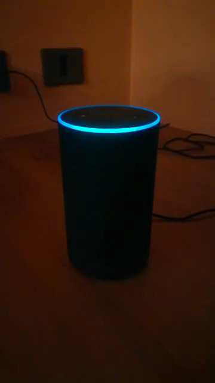
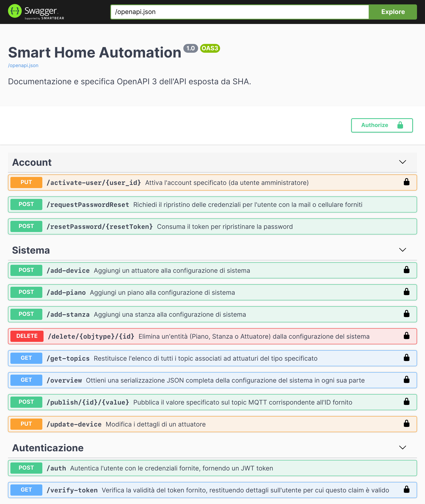
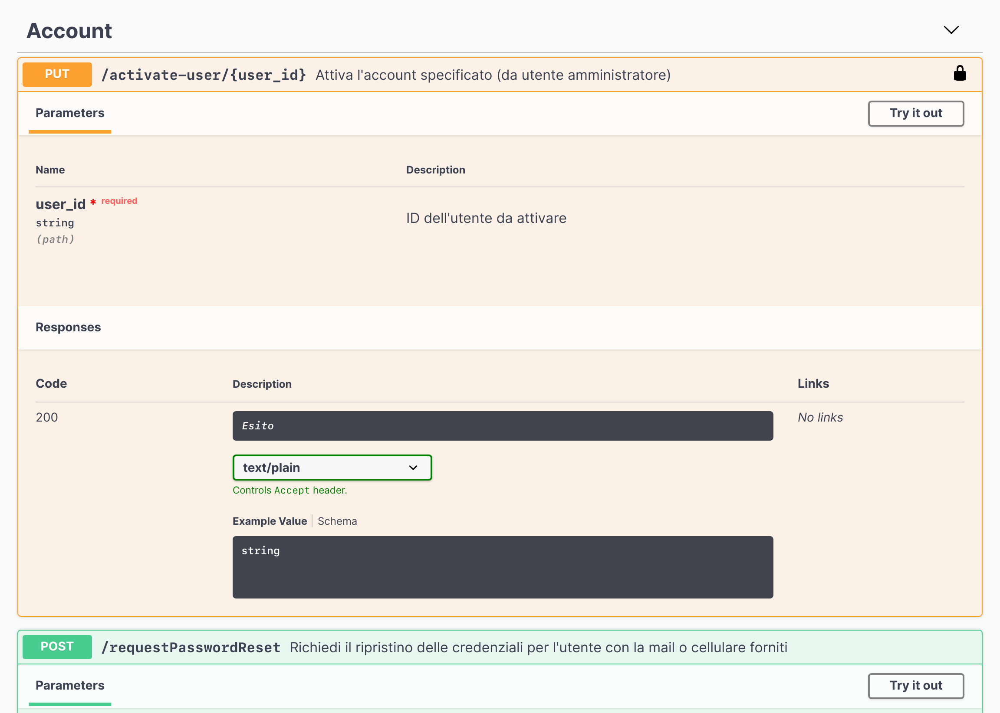
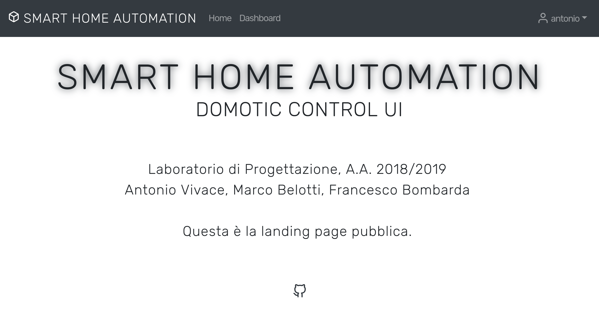
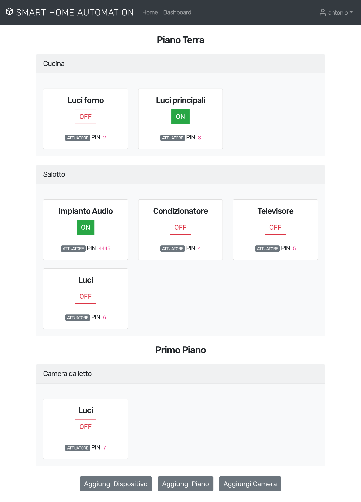

# Smart Home Automation

> A Rasberry Pi integrated domotic solution with MQTT. Supports sensors, actuators and thermostat. Controllable from a web application, smart speakers or a basic SMS interface.

Design Lab project. 2018/2019. Marco Belotti, Francesco Bombarda, Antonio Vivace.

## Documentation

- [Requisiti](https://github.com/avivace/sha/raw/master/docs/Requisiti.pdf)
- [Architettura](https://github.com/avivace/sha/raw/master/docs/Architettura.pdf)
- [Implementazione](https://github.com/avivace/sha/raw/master/docs/Implementazione.pdf)
- [Convalida](https://github.com/avivace/sha/raw/master/docs/Convalida.pdf)

## Implementation

- `/backend`: Python3 Connexion web application, MQTT daemon and helper classes. OpenAPI3 definition of the exposed interface.
- `/c8h18`: VueJS frontend
- `/legacy-app`: old app, tests and miscellanea

## Screenshots

Demo Video:

Swagger UI:

Detail of a single route:

Frontend landing page:

Overview of the system:

