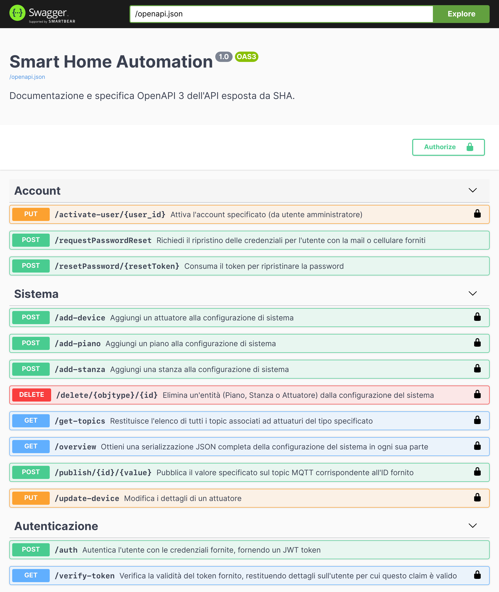
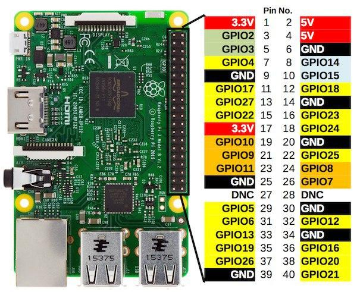
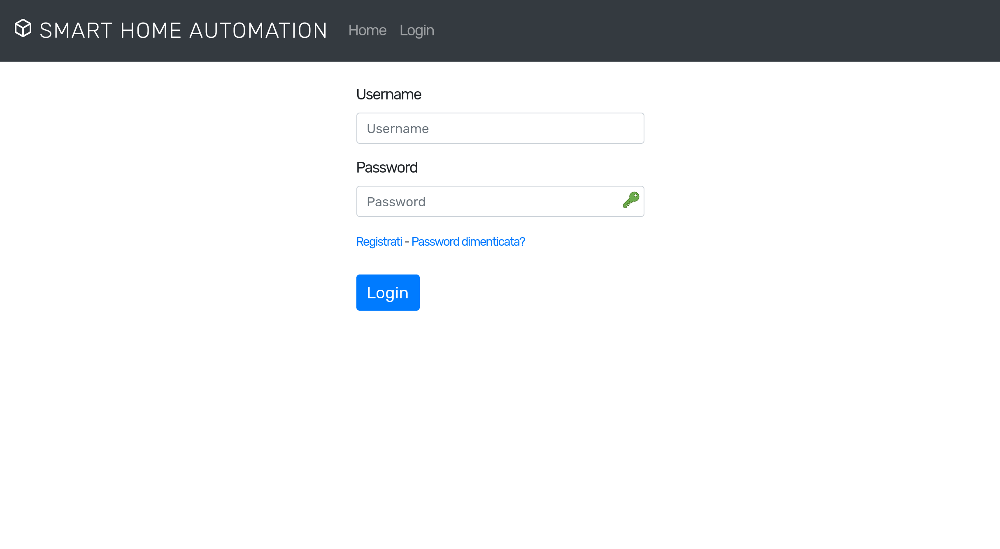
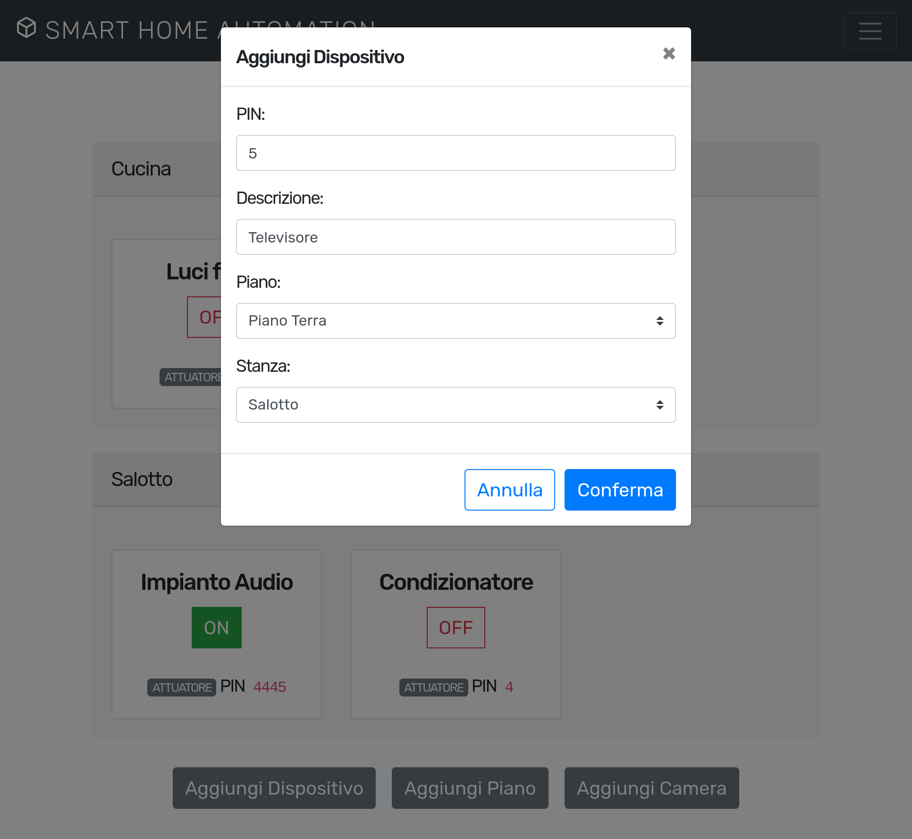
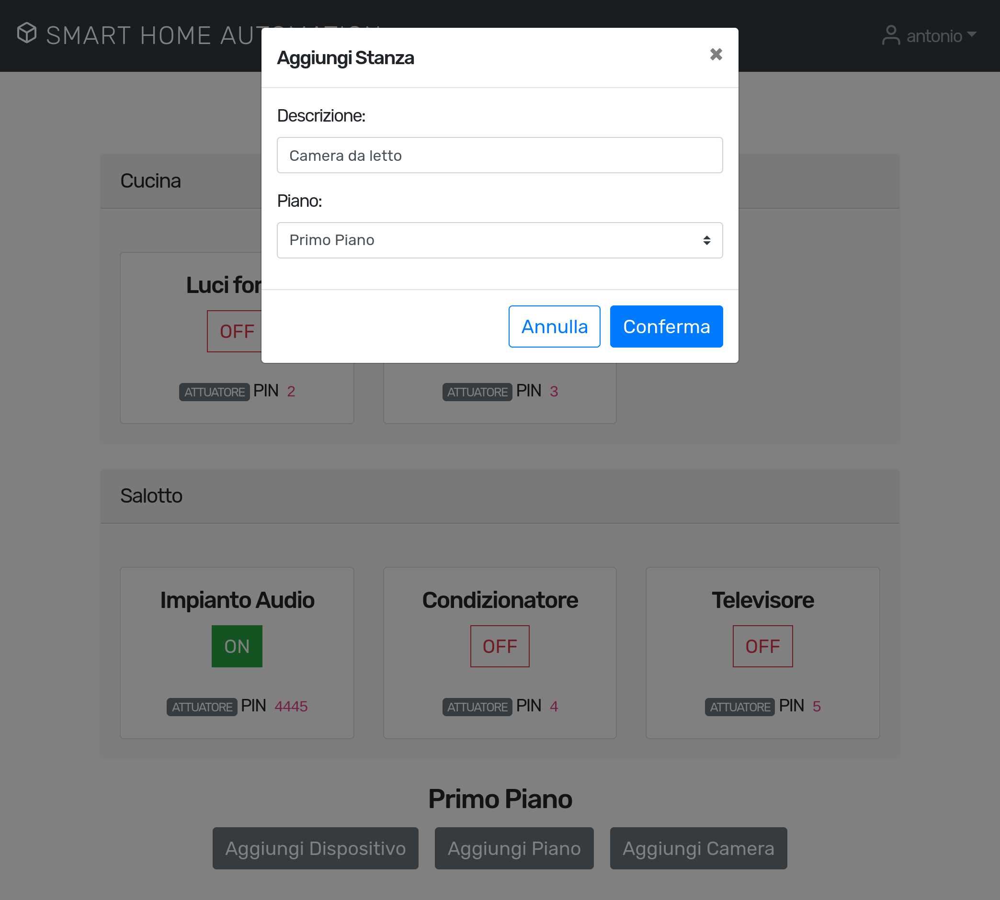
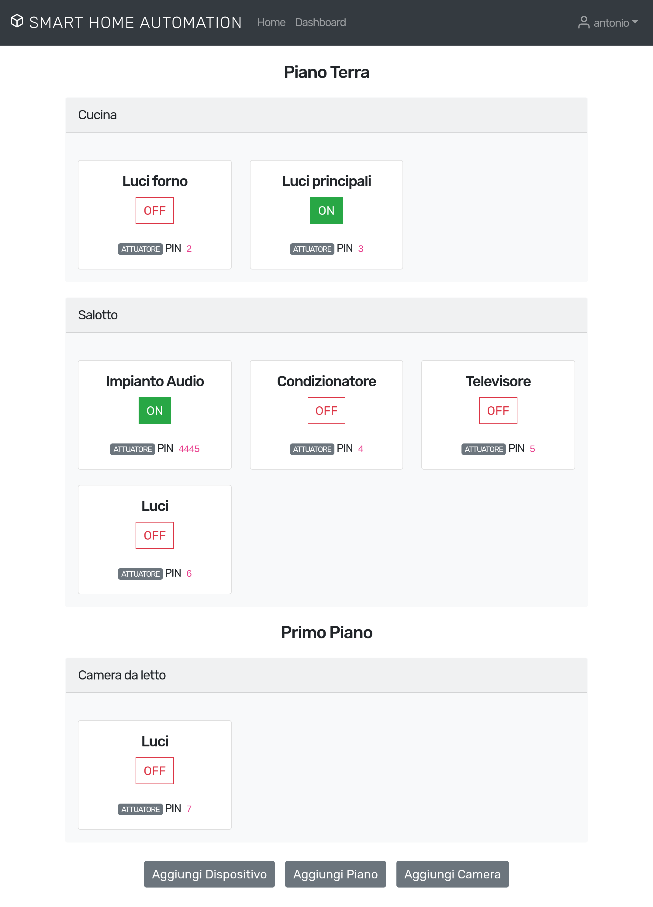

## Introduzione

Questo documento fornisce una panoramica del software realizzato per implementare le funzionalità del sistema SHA.

Chiariremo qual è il sottoinsieme di funzionalità che abbiamo deciso di implementare nel software finale.

Verranno introdotti e contestualizzati i vari strumenti, librerie software, tecniche e pattern utilizzati specificandone gli standard e le norme industriali che li descrivono.

Particolare rilevanza è stata data al modo in cui ognuno dei diversi strumenti copre il proprio ruolo e come essi vengono incastonati nel sistema che realizza un intero stack web.

Infine, verrà spiegato brevemente come preparare un sistema UNIX all'esecuzione di ognuna delle componenti del software stesso, preoccupandosi di soddisfare i prerequisiti, di installare automaticamente gli ambienti che provvedano a tutte le dipendenze ed infine eseguire ed esporre i servizi finali.

Tutti i software utilizzati sono open source e rilasciati con licenze libere.

# Funzionalità implementate

Rispetto ai requisiti e all'architettura descritti negli altri documenti, abbiamo deciso di implementare un sotto insieme significativo di questi ultimi. In generale, sono state implementate le funzionalità che potessero permettere ai casi d'uso principali di funzionare.
Il software fornisce un framework solido su cui, eventualmente, preparare e aggiungere le nuove caratteristiche, oppure espandere quelle esistenti.

In particolare:

- Tutte le funzionalità sono esposte come API Restful, definite formalmente con uno schema OpenAPI 3.
  + I parametri della richiesta e le risposte sono sempre validati formalmente con altrettanti schema.
  + Tutte le risposte serializzate in JSON.
  + L'API è agnostica e sfruttabile da qualsiasi libreria o ambiente di sviluppo dotato di un client HTTP.
  + Viene generata una documentazione dinamica di ognuna delle funzionalità esposte dall'API, mostrando come utilizzare e cosa aspettarsi da ognuna delle funzionalità.
  + Secondo le linee guida per le API RESTful, vengono utilizzati i metodi HTTP adeguati al tipo di operazione. Se essa è stateless e non modifica il sistema (idempontenti e *safe*) è una `GET`. Se aggiorna un oggetto esistente vengono utilizzate le `PUT` mentre se ne vengono creati di nuovi `POST`.
- Esposizione dello stato dei punti luce e modifica degli stessi tramite MQTT.
- Sistema di autenticazione completo basato su JWT. Permette:
  + login, 
  + logout, 
  + gestione di sessione, 
  + registrazione,
  + recupero credenziali,
  + fare richieste/ricevere risposte autenticate e firmate.
- Diversi livelli di utenza.
- L'intero stato della configurazione è in un database SQLite di cui si possono facilmente fare snapshot periodici, esportarli ed importarli.

Sono state create classi per poter sfruttare un mailer e gestire anche l'invio di email secondo template per notifiche e recupero dell'account.

L'applicazione web "Swagger UI" fornita con Connexion, documenta la nostra API, visualizzandone una descrizione completa e fornendo uno strumento per testare ogni rotta secondo i parametri definiti.

È possibile anche procedere all'autenticazione JWT durante il testing delle rotte, di fatto permettendo l'utilizzo anche delle rotte protette (segnate con il lucchetto).

Il frontend, un applicazione reattiva scritta in VueJS, responsive ed utilizzabile su qualsiasi dispositivo dotato di browser web, sfrutta alcuni di questi metodi, fornisce un'implementazione base di UI espandibile facilmente:

- Login/logout
- Autenticazione di ogni richiesta successiva
- Visuale riassuntiva del sistema
- Aggiunta stanza
- Aggiunta piano
- Aggiunta dispositivo
- Recupera password
- Registrazione utente

Il sistema di autenticazione è stato realizzato da zero sfruttando JWT per verificare i claim ed autenticare le singole richieste.

Viene impostato un valore di *salt* uguale sul frontend e sul backend (environment variable). Ogni password viene concatenata a questo salt e ne viene prodotto un hash con SHA5. Solo a quel punto viene salvata e/o confrontata con il valore corretto (server side).
Se questo va a buon fine, viene rilasciato un token firmato che conferma la rivendicazione sull'utente.

Un token vale solo per la sessione in corso ed è possibile personalizzare la sua validità temporale.

## Istanza di test

Un'istanza di test è pubblica a questo indirizzo:

- [`http://188.166.124.245:8080`](http://188.166.124.245:8080) (Frontend)
- [`http://188.166.124.245:8081/ui`](http://188.166.124.245:8081/ui) (Documentazione API)


# Backend




## Panoramica degli strumenti

#### MQTT

MQTT (MQ Telemetry Transport or Message Queue Telemetry Transport) è un protocollo ISO standard (ISO/IEC PRF 20922) di messaggistica leggero di tipo publish-subscribe posizionato in cima a TCP/IP. È stato progettato per le situazioni in cui è richiesto un basso impatto e dove la banda è limitata. Il pattern publish-subscribe richiede un message broker. Il broker è responsabile della distribuzione dei messaggi ai client destinatari. 

- [ISO/IEC PRF 20922](https://webstore.iec.ch/preview/info_isoiec20922%7Bed1.0%7Den.pdf)

Dall'applicazione web, usiamo Mosquitto per poter pubblicare i messaggi, mentre sul sistema, il pachetto "mqtt" permette di avviare un demone che fa subscribe sui topic specificati.

Nella nostra specifica implementazione, il dispositivo (Raspberry) predisposto 
per il controllo dei dispositivi fisici (Attuatori e sensori), implementa un 
client MQTT e si pone in ascolto di alcuni topic associati ai dispositivi 
installati nell'abitazione, attuando i comandi richiesti 
(accensione o spegnimento) sulla base delle richieste provenienti dagli strati 
superiori dell'architettura e agendo direttamente sull'interfaccia GPIO.



#### JWT

I JWT sono degli oggetti (tokens) che permettono di inviare dati ad un server usando il formato JSON. Questo è molto utile per creare un sistema di autenticazione user stateless.

L’autenticazione dell’user e la gestione delle sessioni, vengono quasi sempre fatte attraverso l’uso dei Cookies. Il processo di login con un sistema basato sui cookies di solito è basato su quattro passaggi:

- Cliente invia dettagli di login
- Server risponde con il cookie ed il session ID
- Cliente ri-invia il cookie quando richiede una nuova pagina
- Server effettua un controllo sul cookie e accetta / rifiuta la connessione

Con l’uso dei JSON Web Tokens il processo è molto simile ma con alcune differenze:

Anche con i JWT, quando il client effettua il login correttamente il server gli invia in risposta un token. Questo token viene salvato nel local storage ed inviato al server che effettuerà i controlli necessari e risponderà.

La differenza principale è che con l’utilizzo delle sessions, il server ha bisogno di salvare i dati relativi ai suoi user in memoria. Nel caso dei JWT invece tutti i dati necessari sono contenuti nel token stesso, rendendo il server stateless. 

Questo ci può tornare molto utile quando stiamo sviluppando applicazioni a singola pagina, dove il codice client è completamente indipendente dal codice server.

- [RFC 7515](https://tools.ietf.org/html/rfc7515) - JSON Web Signature (JWS)
- [RFC 7516](https://tools.ietf.org/html/rfc7516) - JSON Web Encryption (JWE)
- [RFC 7519](https://tools.ietf.org/html/rfc7519) - JSON Web Token (JWT)

Una volta ottenuto e validato un token che certifica la nostra "rivendicazione" di essere un dato utente, basterà consumare ogni rotta che richiede l'autenticazione (segnata con un lucchetto sulla nostra documentazione) aggiungendo un HEADER al pacchetto HTTP che include il nostro token.

Esempio:

```bash
curl -X GET "http://localhost:8080/secret" -H  "accept: text/plain" -H
 "Authorization: Bearer $TOKEN"
```

#### Open API 3.0

La Specifica OpenAPI (conosciuta originariamente come la Specifica Swagger) è una specifica per file di interfaccia leggibili dalle macchine per descrivere, produrre, consumare e visualizzare servizi web RESTful.

Una serie di strumenti può generare codice, documentazione e test case dato un file di interfaccia.

- [OpenAPI Specification, version 3.0.0](https://github.com/OAI/OpenAPI-Specification/blob/master/versions/3.0.0.md)

#### Flask

Flask è un framework web leggero scritto in Python e basato sullo strumento Werkzeug WSGI e con il motore template Jinja2. Ha licenza BSD.

Flask è un microframework perché ha un nucleo semplice ma estensibile. Non c'è uno strato di astrazione per la base di dati, validazione delle form, o qualsiasi altra componente dove esistono già librerie di terze parti per fornire funzionalità comuni (per cui noi usiamo Connexion per le validazioni delle rotte e SQL Alchemy come driver ed ORM per SQLite) Sebbene, Flask supporti estensioni, che possono aggiungere funzionalità ad un'applicazione come era implementato in Flask stesso. Ci sono estensioni per mappatori ad oggetti-relazionali, gestione del caricamento, e varie tecnologie di autenticazione e altro. 

#### Connexion

Connexion funziona come "wrapper" dell'applicazione Flask, estendendola.

È un ambiente completo per implementare delle applicazioni che espongono un API definita con standard OpenAPI. Fornisce un'interfaccia che autodocumenta le rotte descritte e permette di testarle ed utilizzarle durante lo sviluppo.

La specifica delle rotte in OpenAPI 3 è in `openapi.yaml`.

Ognuna delle rotte è legata ad un metodo che implementa effettivamente quell'azione (nel file `api.py`). Connexion si occupa di castare e passare a questo file i payload, i parametri, le informazioni contenute nelle URL templatizzate e le informazioni di autenticazioni che arrivano dal client che utilizza la nostra API.

Vengono anche definite formalmente le risposte.

Dato che ogni rotta è formalmente definita, e specifica che tipo di oggetti deve ricevere (Query param, URL templatizzate, JSON payloads), procede in autonomia alla loro valutazioni, sollevano opportune eccezioni in caso di fallito casting ai tipi desiderati, parametri mancanti o malformati, od in generale quando la richiesta non viene costruita come precedentemente definito.

Una volta avviato, su `localhost:8080` viene esposta l'API, mentre su `localhost:8080/ui` è visualizzaible l'applicazione web Swagger UI che documenta le rotte.

#### SQLite

SQLite è una libreria software scritta in linguaggio C che implementa un DBMS SQL di tipo ACID incorporabile all'interno di applicazioni. Non è un processo standalone utilizzabile di per sé, ma può essere incorporato all'interno di un altro programma.

#### SQLAlchemy

SQLAlchemy ci permette di utilizzare un database SQLite e fa da ORM, fornendo utili metodi e classi per definire i modelli del database ed operarci, senza dover necessariamente scrivere query SQL.

# Frontend

È un'applicazione in VueJS che implementa un'interfaccia utente facile ed immediata, implementando le funzionalità di controllo del sistema e di autenticazione sfruttando alcune delle rotte messe a disposizione dalla nostra API.

- Applicazione reattiva,
- Visualizzazione dello stato del sistema in tempo reale,
- Modifica di ogni punto luce del sistema,
- Funzionante su qualsiasi dispositivo dotato di un browser web.
- Possibilità di trasformarla facilmente in PWA con notifiche in tempo reale sul dispositivo, anche ad app web "chiusa".










## Panoramica degli strumenti

#### Node.js

Node.js è una runtime di JavaScript Open source.
Non è necessaria per eseguire la nostra applicazione frontend, che è completamente client side, ma viene utilizzato durante lo sviluppo per poter usare moduli JS diversi, unirli con webpack ed avviare un server web di prova che serve una build della nostra applicazione web.

In ogni caso, essa è completamente statica ed ottiene tutti i dati consumando con Axios l'API che abbiamo costruita.

#### Webpack

Ci permette di usare varie librerie JavaScript ed in generale fornisce una serie di strumenti utili allo sviluppo.

#### Vue.JS

Vue.js è un framework JavaScript, dedicato alla realizzazione di interfacce web reattive che sfruttano il dual-binding tra modello dati e vista. Ciò significa che rende possibile implementare un’applicazione ragionando in termini di dati, variabili e oggetti, astraendosi rispetto all’implementazione e aggiornamento del DOM della pagina.

Vue-router viene utilizzato per gestire il routing e i redirezionamenti una volta autenticati.

L'applicazione frontend viene avviata con `npm run serve` ed è disponibile a `localhost:8081`.

#### Axios

È la libreria che ci permette di costruire richieste HTTP per poter sfruttare la nostra API.

Ci permette di aggiungere Query params, costruire JSON payloads da oggetti JS e autenticare ogni richiesta con la nostro Bearer Token (JWT). È asincrona e permette di specificare la azioni da intraprendere appena la richiesta è completa, anche in base all'esito della stessa.

Questo ci permette di costruire in tempo reale il DOM del documento HTML, iniettando e rimuovendo i componenti che descrivono gli attuatori (VueJS), in base alle informazioni contenute nelle risposte delle richieste che facciamo con Axios.

#### Bootstrap-Vue

Libreria CSS che ci fornisce una serie di stili, palette e classi per la creazione di interfacce Web moderne e responsive. Ognuno di questi componenti UI espone a sua volta un'interfaccia da cui è possibile modificarne le proprietà in base alla logica client side.


# Deploy

Requisiti iniziali, MQTT e Mosquitto.

Su Debian:

```bash
apt install mqtt mqtt-clients
service mqtt stop
mqtt
mosquitto_sub -h '127.0.0.1' -t '#'
```

Client MQTT gestione illuminazione
```
python gestioneLuci.py
```


## Backend

Requisiti iniziali.

Su Debian:
```
apt install python3 python3-pip python3-venv
```

Prepariamo l'ambiente e avviamo il backend
```bash
cd backend
python3 -m venv .
source bin/activate
pip3 install -r requirements.txt
pip3 install connexion[swagger-ui]
python3 app.py
```

## Frontend

Installare i requisiti iniziali (Node.js ed npm).

Su Debian:
```bash
curl -sL https://deb.nodesource.com/setup_12.x | bash -
apt-get install -y nodejs
```

```bash
cd frontend
npm install
npm run serve
```

# Testing

Test dell'API implementata all'interno del file test.py, per maggiori dettagli consultare il documento di convalida.

Per l'esecuzione dei casi di test, lanciare da terminale il comando `python3 test.py`

# Appendice: specifica completa dell'API implementata


 Endpoint                      | Method | Auth? |
 ----------------------------- | ------ | ----- |
 `/auth`                       | POST   | No    |            
 `/requestPasswordReset`       | POST   | No    |            
 `/resetPassword/{resetToken}` | POST   | No    |            
 `/delete/{objtype}/{id}`      | DELETE | Yes   |            
 `/get-topics`                 | GET    | Yes   |            
 `/publish/{id}/{value}`       | POST   | Yes   |            
 `/overview`                   | GET    | Yes   |            
 `/activate-user/{user_id}`    | PUT    | Yes   |            
 `/update-device`              | PUT    | Yes   |            
 `/add-device`                 | POST   | Yes   |            
 `/add-stanza`                 | POST   | Yes   |            
 `/add-piano`                  | POST   | Yes   |            
 `/verify-token`               | GET    | Yes   |            

### /auth

#### POST
##### Summary:

Autentica l'utente con le credenziali fornite, fornendo un JWT token

##### Responses

| Code | Description |
| ---- | ----------- |
| 200 | JWT token |

### /requestPasswordReset

#### POST
##### Summary:

Richiedi il ripristino delle credenziali per l'utente con la mail o cellulare forniti

##### Responses

| Code | Description |
| ---- | ----------- |
| 200 | Esito |

### /resetPassword/{resetToken}

#### POST
##### Summary:

Consuma il token per ripristinare la password

##### Parameters

| Name | Located in | Description | Required | Schema |
| ---- | ---------- | ----------- | -------- | ---- |
| resetToken | path | Reset token | Yes | string |

##### Responses

| Code | Description |
| ---- | ----------- |
| 200 | Esito |

### /delete/{objtype}/{id}

#### DELETE
##### Summary:

Elimina un'entità (Piano, Stanza o Attuatore) dalla configurazione del sistema

##### Parameters

| Name | Located in | Description | Required | Schema |
| ---- | ---------- | ----------- | -------- | ---- |
| id | path | ID | Yes | string |
| objtype | path | Tipo | Yes | string |

##### Responses

| Code | Description |
| ---- | ----------- |
| 200 | Response |

##### Security

| Security Schema | Scopes |
| --- | --- |
| jwt | secret |

### /get-topics

#### GET
##### Summary:

Restituisce l'elenco di tutti i topic associati ad attuaturi del tipo specificato

##### Responses

| Code | Description |
| ---- | ----------- |
| 200 | Response |

##### Security

| Security Schema | Scopes |
| --- | --- |
| jwt | secret |

### /publish/{id}/{value}

#### POST
##### Summary:

Pubblica il valore specificato sul topic MQTT corrispondente all'ID fornito

##### Parameters

| Name | Located in | Description | Required | Schema |
| ---- | ---------- | ----------- | -------- | ---- |
| id | path | ID attuatore | Yes | string |
| value | path | Valore | Yes | string |

##### Responses

| Code | Description |
| ---- | ----------- |
| 200 | Esito |

##### Security

| Security Schema | Scopes |
| --- | --- |
| jwt | secret |

### /overview

#### GET
##### Summary:

Ottieni una serializzazione JSON completa della configurazione del sistema in ogni sua parte

##### Responses

| Code | Description |
| ---- | ----------- |
| 200 | Response |

##### Security

| Security Schema | Scopes |
| --- | --- |
| jwt | secret |

### /activate-user/{user_id}

#### PUT
##### Summary:

Attiva l'account specificato (da utente amministratore)

##### Parameters

| Name | Located in | Description | Required | Schema |
| ---- | ---------- | ----------- | -------- | ---- |
| user_id | path | ID dell'utente da attivare | Yes | string |

##### Responses

| Code | Description |
| ---- | ----------- |
| 200 | Esito |

##### Security

| Security Schema | Scopes |
| --- | --- |
| jwt | secret |

### /update-device

#### PUT
##### Summary:

Modifica i dettagli di un attuatore

##### Responses

| Code | Description |
| ---- | ----------- |
| 200 | Outcome |

##### Security

| Security Schema | Scopes |
| --- | --- |
| jwt | secret |

### /add-device

#### POST
##### Summary:

Aggiungi un attuatore alla configurazione di sistema

##### Responses

| Code | Description |
| ---- | ----------- |
| 200 | Outcome |

##### Security

| Security Schema | Scopes |
| --- | --- |
| jwt | secret |

### /add-stanza

#### POST
##### Summary:

Aggiungi una stanza alla configurazione di sistema

##### Responses

| Code | Description |
| ---- | ----------- |
| 200 | Esito |

##### Security

| Security Schema | Scopes |
| --- | --- |
| jwt | secret |

### /add-piano

#### POST
##### Summary:

Aggiungi un piano alla configurazione di sistema

##### Responses

| Code | Description |
| ---- | ----------- |
| 200 | Esito |

##### Security

| Security Schema | Scopes |
| --- | --- |
| jwt | secret |

### /verify-token

#### GET
##### Summary:

Verifica la validità del token fornito, restituendo dettagli sull'utente per cui questo claim è valido

##### Responses

| Code | Description |
| ---- | ----------- |
| 200 | secret response |

##### Security

| Security Schema | Scopes |
| --- | --- |
| jwt | secret |
